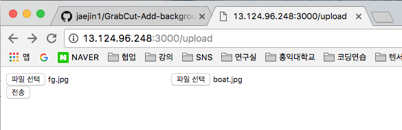
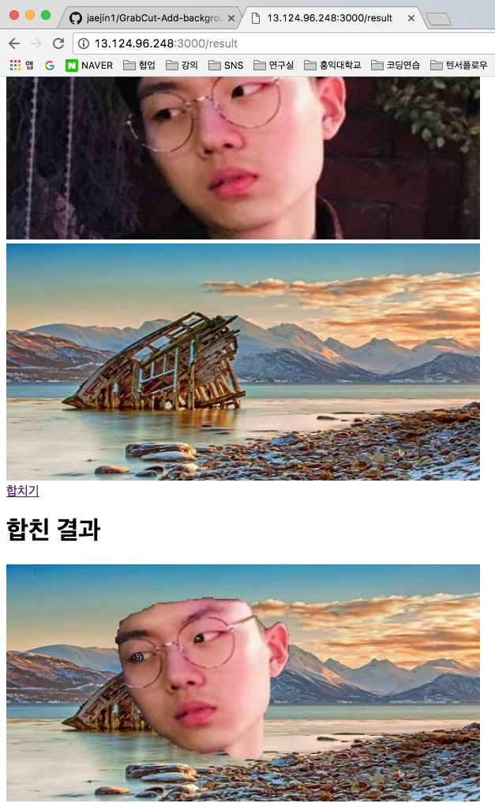
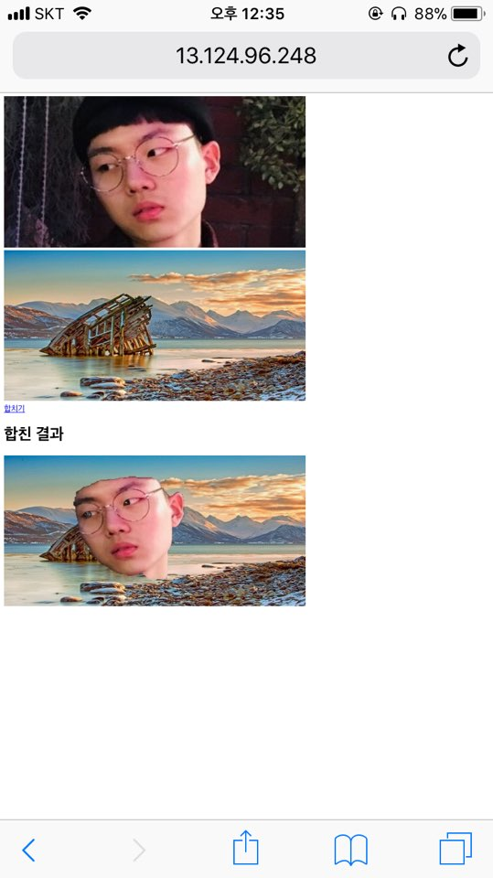

## Erase and insert background

We use the openCV library's Grabcut algorithm to erase the background and then add the new background we want.

---

### Team Member

* B389056 이재진
* B384044 정문종
* B389085 한동욱

---

### To Do

1.  To use the GrabCut algorithm, **find the code** in github. The code we found temporarily is in the link. This code is forked.  [Link](https://github.com/jaejin1/GrabCut)
2.  Once you have found the code, analyze and understand it. Then drag the image first to remove the object recognition behavior and **automatically modify** the object to recognize it.
3.  If you have perfectly deleted the background, the original function of the GrabCut is to completely erase the background to leave only the object. Then **add the function to receive the key and select the background**. The background is saved in advance.
4.  Finally, **if I have time**, I will make all of these functions into a web application. You will then be able to set the background and object pictures and get the results.

---

### Example

 

Original image

Delete the background

The background was erased

Add new background

---

### Technical interpretation

1. In the original grabcut algorithm, delete the part that selects the object and select the entire picture.

2. Because the final goal is to run on the Web, running the program automatically clears the background.

3. I used a module called Python-Shell to connect to a Python file from a server called Node.js. This module passes the values ​​from webserver to a python file.

---

### Result

* Select the photos and backgrounds from which you want to draw objects.

* Select the picture and press the Combine button.

* The results can be obtained after a certain period of time has elapses.

* Since we created Web App, it is available on smartphone.

---

### How to run

1. #### install
	* Node.js
		* express
		* body-parser
		* python-shell
		* multer
	* python
		* OpenCv
		* numpy

2. #### run
	From Web2 Directory

	**$ node app.js**